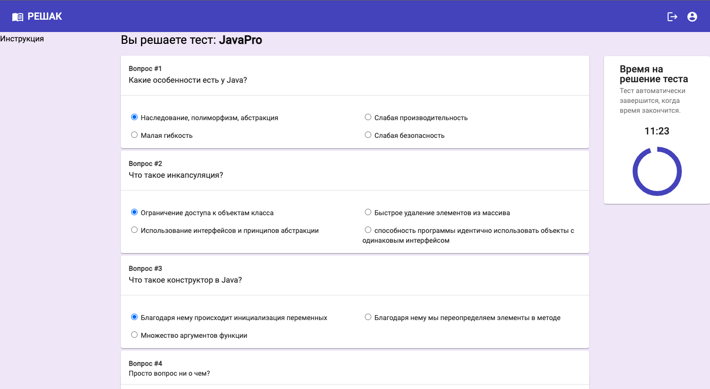

#Java
Проект представляет из себя портал с тестами. Есть панель администратора и панель пользователя. Администратор может добавлять категории тестов, добавлять сами тесты и вопросы к ним. Может ограничивать доступ к тестам, может редактировать все, начиная от своего профиля, заканчивая вопросами к тестам. Может удалять вопросы, категории, сами тесты, результаты тестов пользователей. Пользователь может просмотреть список доступных тестов, зайти и решить какой-то из них, результат будет доступен сразу после отправки теста на проверку. Список всех результатов он может посмотреть на отдельной странице. На портале есть регистрация и авторизация, реализованная с помощью Jwt токена. Фронт на Angular(Репозиторий - ExamPortalFront). Запросы на Back могут приходить только с указанного в CrossOrigin адреса. Также реализована защита на стороне фронта с помощью guards. Но, если каким-то образом будет получен доступ к страницам администратора, на стороне BackEnd'a реализована защита на уровне ролевой модели. Проект написан в учебных целях

